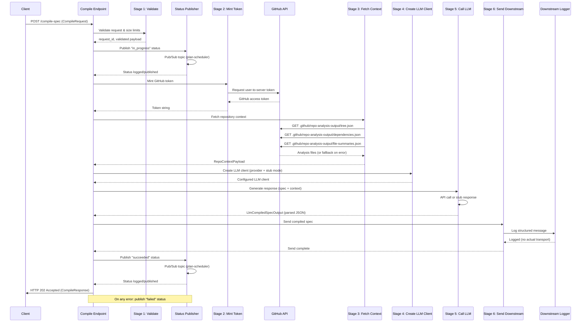

# Spec Compiler Service

A FastAPI service for compiling specifications with LLM integrations. This service provides a robust foundation with health checks, structured logging, request tracing, and observability features designed for Cloud Run deployment.

## Features

- **FastAPI Framework**: Modern async Python web framework with automatic OpenAPI documentation
- **Structured Logging**: JSON-formatted logs compatible with Google Cloud Logging
- **Request Tracing**: Automatic request ID propagation for distributed tracing
- **Error Handling**: Uniform error responses with request correlation for debugging
- **Health Endpoints**: Standard health check and version endpoints for orchestration
- **CORS Support**: Configurable CORS middleware
- **Configuration Management**: Environment-based settings with sensible defaults
- **Testing**: Comprehensive test suite with pytest

## Quick Start

### Prerequisites

- Python 3.11 or higher
- pip for package management
- Virtual environment tool (venv, included with Python 3.11+)

**Note**: These instructions work on macOS, Linux, and Windows. On Windows, use `python` instead of `python3`. The virtual environment activation command depends on your shell:
- **Command Prompt**: `venv\Scripts\activate`
- **PowerShell**: `.\venv\Scripts\Activate.ps1`
- **Git Bash**: `source venv/Scripts/activate`

### Installation

1. Clone the repository:
```bash
git clone <repository-url>
cd spec-compiler
```

2. Create and activate a virtual environment:
```bash
python3 -m venv venv
source venv/bin/activate  # On Windows: venv\Scripts\activate
```

3. Install dependencies:
```bash
pip install -r requirements.txt
```

4. Configure environment variables:
```bash
cp .env.example .env
# Edit .env with your configuration
```

**⚠️ Security Warning**: Never commit your `.env` file or any file containing real secrets to version control. The `.env` file is already in `.gitignore` to prevent accidental commits. Always use `.env.example` as a template and keep actual secrets local only. You can verify your .env is ignored by running `git status --ignored`.

### Running the Service

Start the development server with environment variables loaded from `.env`:

```bash
# The application automatically loads .env via python-dotenv (configured in config.py)
# On macOS/Linux:
PYTHONPATH=src python -m uvicorn spec_compiler.app.main:app --host 0.0.0.0 --port 8080 --reload

# On Windows (Command Prompt):
set PYTHONPATH=src && python -m uvicorn spec_compiler.app.main:app --host 0.0.0.0 --port 8080 --reload

# On Windows (PowerShell):
$env:PYTHONPATH="src"; python -m uvicorn spec_compiler.app.main:app --host 0.0.0.0 --port 8080 --reload
```

**How Environment Variables are Loaded**:
- The `python-dotenv` package is included in `requirements.txt`
- Environment variables are automatically loaded from `.env` file when the application starts (see `config.py`)
- You can override any `.env` value by setting it explicitly in your shell (e.g., `PORT=3000 PYTHONPATH=src python -m uvicorn ...`)
- The `APP_ENV` variable controls behavior (development mode enables auto-reload and verbose logging)

The service will be available at:
- API: http://localhost:8080
- Interactive API docs (Swagger UI): http://localhost:8080/docs
- OpenAPI schema: http://localhost:8080/openapi.json
- Health check: http://localhost:8080/health
- Version info: http://localhost:8080/version

### Testing

Run the test suite:
```bash
pytest
```

Run with coverage:
```bash
pytest --cov=src/spec_compiler --cov-report=html
```

#### Status Publishing Tests

The repository includes comprehensive test coverage for the plan status publishing system:

**Test Organization:**
- `tests/test_plan_status_model.py` - PlanStatusMessage model validation, serialization, edge cases (20 tests)
- `tests/test_plan_scheduler_publisher.py` - PlanSchedulerPublisher configuration, retries, concurrency (25 tests)
- `tests/test_compile_endpoint_status_publishing.py` - Endpoint integration for status publishing (12 tests)
- `tests/test_middleware.py` - Middleware error handling with status publishing (22 tests)
- `tests/test_health_debug_status.py` - Debug endpoint for testing status publishing (4 tests)

**Running Status Publishing Tests:**
```bash
# Run all status publishing tests
PYTHONPATH=src pytest tests/test_plan_status_model.py tests/test_plan_scheduler_publisher.py tests/test_compile_endpoint_status_publishing.py tests/test_middleware.py tests/test_health_debug_status.py -v

# Run tests for a specific area
PYTHONPATH=src pytest tests/test_plan_scheduler_publisher.py -v

# Run tests with coverage
PYTHONPATH=src pytest tests/test_plan_scheduler_publisher.py --cov=src/spec_compiler/services/plan_scheduler_publisher --cov-report=html
```

**Test Coverage Highlights:**

*PlanStatusMessage Model:*
- Field validation (empty/whitespace/negative values)
- Timestamp auto-population and custom values
- Error message truncation and secret sanitization
- JSON serialization (dict and bytes)
- Edge cases (zero spec_index, missing fields)

*PlanSchedulerPublisher:*
- Configuration validation (missing/empty/invalid settings)
- Successful message publishing with ordering keys
- Retry logic for transient errors (ServiceUnavailable, DeadlineExceeded)
- No retry for permanent errors (PermissionDenied)
- Exponential backoff with jitter
- Concurrent request handling and thread safety
- Timeout error capture with correlation IDs
- Large payload handling

*Compile Endpoint Integration:*
- `in_progress` status published after validation
- `succeeded` status published after completion
- `failed` status published on minting errors, LLM errors, parsing failures
- Request ID propagation to all status messages
- Publisher failures don't break compile flow
- Error responses returned even when publish fails
- Large error messages truncated

*Middleware Error Handling:*
- Failed status published when compile requests throw exceptions
- Plan context extracted from request body for status publishing
- Publisher failures don't prevent error responses
- Status publishing exactly once per error
- Graceful handling of unparseable request bodies

**Test Fixtures and Utilities:**

The `tests/conftest.py` file provides reusable fixtures for status publishing tests:

```python
# Mock publisher that captures messages
def test_example(mock_publisher):
    # Make API call
    response = client.post("/compile-spec", json=payload)
    
    # Verify messages
    assert mock_publisher.call_count == 2
    in_progress = mock_publisher.get_messages_by_status("in_progress")
    succeeded = mock_publisher.get_messages_by_status("succeeded")
    assert len(in_progress) == 1
    assert len(succeeded) == 1
```

Available fixtures:
- `mock_publisher` - Captures status messages for verification
- `mock_publisher_disabled` - Simulates publisher not configured
- `test_client` - FastAPI test client with GitHub/LLM mocks
- `test_client_with_error_routes` - Test client with error-throwing endpoints

**No Pub/Sub Network Calls:**

All tests use mocked Pub/Sub clients - no network calls are made during testing:
- `PlanSchedulerPublisher` accepts dependency-injected `client` parameter
- Tests inject `Mock()` instances instead of real `pubsub_v1.PublisherClient`
- All publish operations are captured in-memory for assertions
- Tests run offline without GCP credentials or connectivity

**Troubleshooting Test Failures:**

If status publishing tests fail:

1. **Import Errors**: Ensure all dependencies are installed: `pip install -r requirements.txt`
2. **Module Not Found**: Set `PYTHONPATH=src` before running pytest
3. **Mock Not Working**: Check that patches target the correct import path (e.g., `spec_compiler.app.routes.compile.get_publisher`)
4. **Fixture Cleanup**: Ensure fixtures properly tear down mocks to avoid test pollution
5. **Concurrency Tests**: Thread safety tests may be timing-sensitive; re-run if sporadic failures occur

### Code Quality

Format code with Black:
```bash
black src/ tests/
```

Lint with Ruff:
```bash
ruff check src/ tests/
```

Type check with mypy:
```bash
mypy src/
```

### Pre-commit Hooks (Optional)

Pre-commit hooks are available to automatically run formatting and linting checks before each commit:

```bash
# Install pre-commit
pip install pre-commit

# Install the git hooks
pre-commit install

# Run manually on all files (optional)
pre-commit run --all-files
```

The pre-commit hooks will automatically run black, ruff, and pytest before each commit.

### Continuous Integration

This project uses GitHub Actions for continuous integration. On every pull request and push to main, the CI workflow will:

- Install Python 3.11 and dependencies
- Run black formatting checks
- Run ruff linting checks  
- Run the full test suite with coverage reporting

See `.github/workflows/ci.yml` for the complete CI configuration.

## Compile Pipeline

The spec-compiler service processes specification compilation requests through a multi-stage pipeline with comprehensive logging and status publishing. Understanding this pipeline is essential for integrators and developers working with the service.

### Pipeline Architecture

The compilation pipeline executes the following stages sequentially:



### Stage-by-Stage Breakdown

#### Stage 1: Validate Request
**Function**: `stage_validate_request`
- **Purpose**: Parse and validate incoming compile request
- **Actions**:
  - Check request body size against `MAX_REQUEST_BODY_SIZE_BYTES` limit (default: 10MB)
  - Parse JSON body and validate with `CompileRequest` Pydantic model
  - Sanitize optional `Idempotency-Key` header
  - Generate or extract `request_id` for tracing
- **Logs**: `stage_validate_request_start`, `stage_validate_request_complete`
- **Errors**: Returns HTTP 413 (body too large) or HTTP 422 (validation failed)

#### Stage 2: Publish In-Progress Status
- **Purpose**: Notify plan-scheduler that compilation has started
- **Actions**:
  - Create `PlanStatusMessage` with status `in_progress`
  - Publish to Google Cloud Pub/Sub topic (`PUBSUB_TOPIC_PLAN_STATUS`)
  - Uses `plan_id` as ordering key to ensure sequential processing
- **Logs**: `stage_publish_in_progress`, `Published plan status message`
- **Errors**: Logged but never block pipeline (status publishing failures are non-fatal)

#### Stage 3: Mint GitHub Token
**Function**: `stage_mint_token`
- **Purpose**: Obtain GitHub user-to-server access token from minting service
- **Actions**:
  - Call `POST {MINTING_SERVICE_BASE_URL}/api/token` with IAM authentication
  - Receive GitHub access token (format: `gho_...`)
  - Cache token for subsequent requests (5-minute expiry buffer)
- **Logs**: `stage_mint_token_start`, `minting_token_success`, `stage_mint_token_complete`
- **Errors**: 
  - HTTP 500: Minting service not configured (`MINTING_SERVICE_BASE_URL` missing)
  - HTTP 502: Minting service returned 4xx error (auth/config issue)
  - HTTP 503: Minting service returned 5xx error (temporary failure)
  - Publishes `failed` status before returning error

#### Stage 4: Fetch Repository Context
**Function**: `stage_fetch_repo_context`
- **Purpose**: Retrieve repository analysis files for LLM context
- **Actions**:
  - Fetch `tree.json` (repository file structure)
  - Fetch `dependencies.json` (project dependencies)
  - Fetch `file-summaries.json` (key file summaries)
  - Use fallback placeholder data for any missing/malformed files
- **Logs**: `stage_fetch_repo_context_start`, `repo_context_*_success/error`, `stage_fetch_repo_context_complete`
- **Errors**: Never fatal - uses fallback data to allow compilation to proceed

#### Stage 5: Create LLM Client
**Function**: `stage_create_llm_client`
- **Purpose**: Initialize LLM client based on configuration
- **Actions**:
  - Check `LLM_STUB_MODE` setting (defaults to `false`)
  - If stub mode: return `StubLlmClient` (uses `sample.v1_1.json` from repository root)
  - If provider=openai: return `OpenAiResponsesClient` (requires `OPENAI_API_KEY`)
  - If provider=anthropic: return `ClaudeLlmClient` (requires `CLAUDE_API_KEY`)
- **Logs**: `stage_create_llm_client_start`, `llm_client_created`, `stage_create_llm_client_complete`
- **Errors**: 
  - HTTP 500: Invalid provider or missing API key
  - Publishes `failed` status before returning error

#### Stage 6: Call LLM Service
**Function**: `stage_call_llm`
- **Purpose**: Generate compiled specification using LLM
- **Actions**:
  - Build `LlmRequestEnvelope` with system prompt, spec data, and repo context
  - Call `llm_client.generate_response()` with latency tracking
  - Parse response as `LlmCompiledSpecOutput` (JSON with issues array)
  - Record provider, model, duration, and token usage metrics
- **Logs**: `stage_call_llm_start`, `calling_llm_service`, `llm_service_response_received`, `llm_response_parsed_successfully`, `stage_call_llm_complete`
- **Errors**:
  - HTTP 503: LLM API error (network/quota/timeout)
  - HTTP 500: Response parsing error or unexpected exception
  - Publishes `failed` status with error details

#### Stage 7: Send Downstream
**Function**: `stage_send_downstream`
- **Purpose**: Forward compiled spec to downstream consumer
- **Actions**:
  - Call `downstream_sender.send_compiled_spec()`
  - Current implementation: `DefaultDownstreamLoggerSender` (logging only)
  - Emits structured log with plan_id, spec_index, version, issue count
  - Future: Will integrate with actual message queue or API
- **Logs**: `stage_send_downstream_start`, `downstream_send`, `stage_send_downstream_complete`
- **Errors**:
  - HTTP 502: Downstream validation or sender error
  - HTTP 500: Unexpected downstream error
  - Publishes `failed` status before returning error

#### Stage 8: Publish Succeeded Status
- **Purpose**: Notify plan-scheduler that compilation completed successfully
- **Actions**:
  - Create `PlanStatusMessage` with status `succeeded`
  - Publish to Pub/Sub topic with `plan_id` ordering key
- **Logs**: `stage_publish_succeeded`, `Published plan status message`
- **Errors**: Logged but never block response (non-fatal)

#### Stage 9: Return Response
- **Purpose**: Send HTTP response to client
- **Actions**:
  - Create `CompileResponse` with request_id, plan_id, spec_index, status "accepted"
  - Return HTTP 202 Accepted
  - Log final metrics (LLM duration, provider, model, issue count)
- **Logs**: `Compile request completed successfully`

### Error Handling and Status Publishing

The pipeline implements comprehensive error handling with status publishing integration:

**Failed Status Publishing**:
- Published automatically on any stage failure (minting, LLM, downstream)
- Includes `error_code` and `error_message` (truncated to 10KB, sanitized)
- Never blocks HTTP error response to client
- Logged if publisher not configured or publish fails

**Status Message Schema**:
```json
{
  "plan_id": "string",
  "spec_index": 0,
  "status": "in_progress|succeeded|failed",
  "request_id": "uuid",
  "timestamp": "ISO8601",
  "error_code": "optional_error_code",
  "error_message": "optional_error_details"
}
```

**Status Flow Integration**:
1. `spec-compiler` publishes status messages → Pub/Sub topic (`PUBSUB_TOPIC_PLAN_STATUS`)
2. `plan-scheduler` subscribes to topic and processes updates
3. Messages use `plan_id` as ordering key for sequential processing
4. Each plan can have multiple specs (spec_index) tracked independently

### Logging and Observability

**Structured Logging**:
- All pipeline stages emit JSON logs (when `LOG_JSON=true`)
- Every log includes `request_id` for distributed tracing
- Stage-specific logs include stage name and relevant context
- Latency tracking for LLM calls (start_timestamp, end_timestamp, duration_seconds)

**Key Log Events**:
- `stage_*_start` / `stage_*_complete`: Stage boundaries
- `minting_token_*`: Token minting lifecycle
- `repo_context_*`: Repository context fetching
- `calling_llm_service` / `llm_service_response_received`: LLM API timing
- `downstream_send`: Downstream forwarding
- `Published plan status message`: Status publishing

**Monitoring Recommendations**:
- Alert on high `failed` status publish rate
- Track LLM duration trends by provider/model
- Monitor fallback usage for repo context files
- Track minting service availability

### Pipeline Configuration

See the [Configuration Guide](#configuration-guide) section below for detailed environment variable documentation.

**Key Pipeline Settings**:
- `LLM_PROVIDER`: Which LLM to use (openai, anthropic)
- `LLM_STUB_MODE`: Enable stub mode for testing without API calls
- `MINTING_SERVICE_BASE_URL`: GitHub token minting service URL
- `GCP_PROJECT_ID` + `PUBSUB_TOPIC_PLAN_STATUS`: Status publishing config
- `DOWNSTREAM_TARGET_URI` + `SKIP_DOWNSTREAM_SEND`: Downstream config

## Configuration Guide

All configuration is managed through environment variables. Copy `.env.example` to `.env` and customize as needed.

### Environment Variables Reference

The following environment variables are available (see `.env.example` for a complete template):

#### Application Settings
- **`APP_ENV`**: Application environment (`development`, `staging`, `production`). Controls logging verbosity and auto-reload behavior.
- **`PORT`**: Server port (default: `8080`). Cloud Run will automatically set this when deployed.
- **`APP_VERSION`**: Application version string (default: `0.1.0`). Can also use git SHA.

#### API Keys (Optional - Not Required for Core Functionality)
- **`OPENAI_API_KEY`**: OpenAI API key for GPT models (format: `sk-...`). Required when `LLM_PROVIDER=openai` and `LLM_STUB_MODE=false`.
- **`CLAUDE_API_KEY`**: Anthropic API key for Claude models (format: `sk-ant-...`). Required when `LLM_PROVIDER=anthropic` and `LLM_STUB_MODE=false`.

#### LLM Configuration
- **`LLM_PROVIDER`**: Which LLM provider to use for spec compilation (default: `openai`). Valid values:
  - `openai`: Use OpenAI GPT models (requires `OPENAI_API_KEY`)
  - `anthropic`: Use Anthropic Claude models (requires `CLAUDE_API_KEY`)
- **`OPENAI_MODEL`**: OpenAI model name when using OpenAI provider (default: `gpt-5.1`). Recommended models: `gpt-5.1` (uses Responses API, see [LLMs.md](LLMs.md) for details).
- **`CLAUDE_MODEL`**: Anthropic Claude model name when using Anthropic provider (default: `claude-3-5-sonnet-20241022`). This is the latest Claude 3.5 Sonnet model (uses Messages API, see [LLMs.md](LLMs.md) for details).
- **`SYSTEM_PROMPT_PATH`**: Optional path to a file containing the system prompt for LLM requests. Can be absolute (e.g., `/app/prompts/system.txt`) or relative to the working directory (e.g., `./prompts/system.txt`). If not set or file is unreadable, a default prompt is used. Large prompt files are cached after first load for performance.
- **`LLM_STUB_MODE`**: Enable stub mode to bypass actual LLM API calls (default: `false`). When `true`, returns stubbed responses without calling external APIs. Useful for:
  - Local development without API keys
  - Testing and CI/CD pipelines
  - Cost savings during development
  - Note: Requires restart to change (not hot-reloadable)

**LLM Provider Selection:**
- Set `LLM_PROVIDER=openai` to use OpenAI GPT models
- Set `LLM_PROVIDER=anthropic` to use Anthropic Claude models
- Invalid provider values will cause startup failure with an error message
- The service validates provider/model configuration at startup and logs warnings for missing API keys

**System Prompt Configuration:**
- If `SYSTEM_PROMPT_PATH` is set but the file is missing or unreadable, the service will log a warning and fall back to the default prompt
- Prompt content is cached in memory after first load to avoid repeated file I/O
- To reload a changed prompt file, restart the service or call the cache clear method programmatically
- Very large prompts (e.g., > 100KB) are loaded once and cached, not streamed per request

#### Google Cloud Configuration

##### Pub/Sub Status Publishing
The service publishes plan status updates to Google Cloud Pub/Sub throughout the compilation lifecycle for consumption by plan-scheduler. Configuration requires:

- **`GCP_PROJECT_ID`**: **REQUIRED** for Pub/Sub publishing. Google Cloud Project ID where the Pub/Sub topic exists (e.g., `my-project-id`).
- **`PUBSUB_TOPIC_PLAN_STATUS`**: **REQUIRED** for status publishing. Pub/Sub topic name for plan status updates (e.g., `plan-status-updates`). Topic must exist in the specified GCP project.
- **`PUBSUB_CREDENTIALS_PATH`**: **OPTIONAL**. Path to GCP service account credentials JSON file (e.g., `/path/to/service-account-key.json` or `./credentials/gcp-sa.json`). If not set, uses Application Default Credentials (ADC):
  - ADC checks (in order): `GOOGLE_APPLICATION_CREDENTIALS` env var → `gcloud auth` → Compute Engine/Cloud Run metadata
  - Only needed for local development or when ADC is unavailable

**Status Message Schema:**
Status messages conform to the `PlanStatusMessage` schema defined in `plan-scheduler.openapi.json`:
- **Required fields**: `plan_id` (string), `spec_index` (integer), `status` (enum), `request_id` (string), `timestamp` (ISO8601 string)
- **Optional fields**: `error_code` (string), `error_message` (string) - used when status is `failed`
- **Allowed status values**: `in_progress`, `succeeded`, `failed`
- **Max payload size**: 10MB (10485760 bytes)
- **Ordering key**: `plan_id` (ensures messages for the same plan are processed in order)

**Compilation Lifecycle Integration:**
The compile endpoint publishes status messages at three key points:
1. **`in_progress`**: Published immediately after request validation, before GitHub token minting or LLM work begins
2. **`succeeded`**: Published after successful LLM compilation and parsing, before returning HTTP 202 response
3. **`failed`**: Published on any error path (minting failures, LLM configuration errors, LLM API errors, parsing failures, unhandled exceptions)

**Error Handling and Resilience:**
- Publisher failures **never prevent** compile responses from being returned to clients
- All publisher errors are logged with request_id correlation but don't raise exceptions
- If publisher is not configured (missing `GCP_PROJECT_ID` or `PUBSUB_TOPIC_PLAN_STATUS`), status publishing is silently disabled
- Unhandled exceptions in middleware also attempt to publish `failed` status if plan context is available
- Error messages in `failed` status are truncated to 10KB and sanitized to prevent secrets leakage

**Status Event Flow:**
1. Client sends compile request → `spec-compiler` validates payload
2. `spec-compiler` publishes `in_progress` status → Pub/Sub topic (`PUBSUB_TOPIC_PLAN_STATUS`)
3. `spec-compiler` performs GitHub token minting, repo context fetching, and LLM compilation
4. On success: `spec-compiler` publishes `succeeded` status → Pub/Sub
5. On failure: `spec-compiler` publishes `failed` status (with error details) → Pub/Sub
6. `plan-scheduler` subscribes to the topic and processes status updates to track compilation progress

**Configuration Validation:**
- Use `settings.validate_pubsub_config()` to check configuration at startup
- Missing `GCP_PROJECT_ID` or `PUBSUB_TOPIC_PLAN_STATUS` will result in validation errors
- Invalid credentials path will be reported but won't block startup (falls back to ADC)

**Testing Status Publishing:**

The service includes a debug endpoint for manually testing status message publishing:

**Debug Endpoint Usage:**
```bash
# Only works when APP_ENV != "production"
curl -X POST http://localhost:8080/debug/status

# Success Response (HTTP 200):
# {
#   "status": "published",
#   "message": "Test status message published successfully",
#   "plan_id": "debug-test-plan",
#   "spec_index": 0
# }

# Production Response (HTTP 403):
# {
#   "detail": "Debug endpoints are only available in development environments"
# }

# Publisher Not Configured (HTTP 500):
# {
#   "detail": {
#     "error": "publisher_not_configured",
#     "message": "...",
#     "request_id": "..."
#   }
# }

# Publish Failed (HTTP 503):
# {
#   "detail": {
#     "error": "publish_failed",
#     "message": "...",
#     "request_id": "..."
#   }
# }
```

**When to Use:**
- Verify Pub/Sub configuration before deploying compile endpoint
- Test credentials and topic permissions
- Validate message format and routing
- Troubleshoot publishing issues in development

**Security Note:** This endpoint is automatically disabled in production (`APP_ENV=production`) to prevent accidental test messages in production topics. Always test in development or staging environments.

##### Other Cloud Configuration
- **`DOWNSTREAM_LOG_SINK`**: **OPTIONAL**. Downstream log sink for Cloud Logging (e.g., `projects/my-project/logs/app-logs`). Not yet used - reserved for future logging integrations.

#### CORS Settings
- **`CORS_ORIGINS`**: Comma-separated list of allowed CORS origins (e.g., `http://localhost:3000,https://example.com`). Leave empty to disable CORS, or use `*` for all origins (not recommended in production).

#### Logging Configuration
- **`LOG_LEVEL`**: Logging level (`DEBUG`, `INFO`, `WARNING`, `ERROR`, `CRITICAL`). Default: `INFO`.
- **`LOG_JSON`**: Enable JSON structured logging (`true`/`false`). Default: `true`. Should be `true` for Cloud Run deployments to integrate with Google Cloud Logging.

#### Request Configuration
- **`REQUEST_ID_HEADER`**: HTTP header name for request correlation (default: `X-Request-Id`). Used for distributed tracing.
- **`MAX_REQUEST_BODY_SIZE_BYTES`**: Maximum request body size in bytes (default: `10485760` = 10MB). Requests exceeding this limit will be rejected with HTTP 413.
- **`MAX_IDEMPOTENCY_KEY_LENGTH`**: Maximum idempotency key length (default: `100`). Keys exceeding this length are truncated for security.

#### GitHub API Configuration
- **`GITHUB_API_BASE_URL`**: Base URL for GitHub REST API (default: `https://api.github.com`). Override for GitHub Enterprise or testing against mock servers.
- **`MINTING_SERVICE_BASE_URL`**: Base URL for the GitHub token minting service. This should be the Cloud Run service URL where the minting service is deployed (e.g., `https://github-token-service-xxxxx-uc.a.run.app`). **Required for GitHub API calls**.
- **`MINTING_SERVICE_AUTH_HEADER`**: Optional authorization header value for authenticating with the minting service. For Cloud Run IAM authentication, this should be a GCP identity token obtained via `gcloud auth print-identity-token` or programmatically via `google.oauth2.id_token.fetch_id_token()`.

**⚠️ Important Notes**:
- LLM configuration is now available for controlling provider, model, and stub mode. Actual LLM API integration is stubbed by default unless `LLM_STUB_MODE=false`.
- GitHub integration and Pub/Sub messaging features are present but may have limited functionality in some environments.
- Never commit real API keys, tokens, or secrets to version control. Always use `.env` for local secrets (already in `.gitignore`).
- For production deployments, use your platform's secret management system (e.g., Google Cloud Secret Manager, AWS Secrets Manager).

### Local Development with Stub Mode

For local development and testing without consuming LLM API quota or requiring API keys, the service supports **stub mode** that returns pre-defined responses from a sample file instead of making actual LLM API calls.

#### Enabling Stub Mode

**Option 1: Environment Variable (Recommended)**

Edit your `.env` file:
```bash
LLM_STUB_MODE=true
```

Restart the service to apply changes (stub mode is not hot-reloadable).

**Option 2: Inline Environment Variable**

```bash
# Linux/macOS
LLM_STUB_MODE=true PYTHONPATH=src python -m uvicorn spec_compiler.app.main:app --host 0.0.0.0 --port 8080 --reload

# Windows PowerShell
$env:LLM_STUB_MODE="true"; $env:PYTHONPATH="src"; python -m uvicorn spec_compiler.app.main:app --host 0.0.0.0 --port 8080 --reload
```

#### How Stub Mode Works

When `LLM_STUB_MODE=true`:

1. **Client Selection**: Service creates `StubLlmClient` instead of `OpenAiResponsesClient` or `ClaudeLlmClient`
2. **Sample Response**: Returns pre-defined compiled spec from `sample.v1_1.json` in repository root
3. **Metadata Simulation**: Response includes simulated provider/model metadata matching configured `LLM_PROVIDER`
4. **No API Calls**: Zero network calls to OpenAI, Anthropic, or other LLM services
5. **Zero Cost**: No API quota consumed, no billing charges

**Stub Response Characteristics**:
- Status: `success`
- Content: Full compiled spec JSON from sample file
- Model: Reflects configured provider (e.g., `gpt-5.1` for OpenAI, `claude-3-5-sonnet-20241022` for Anthropic)
- Usage: Synthetic token counts (all zeros)
- Metadata: Includes `stub_mode: true`, sample file path, version, issue count

#### Testing with Stub Mode

**Making a Test Request**:

```bash
curl -X POST http://localhost:8080/compile-spec \
  -H "Content-Type: application/json" \
  -H "X-Request-Id: test-$(uuidgen)" \
  -d '{
    "plan_id": "test-plan-123",
    "spec_index": 0,
    "spec_data": {"type": "feature", "description": "Test feature"},
    "github_owner": "test-owner",
    "github_repo": "test-repo"
  }'
```

**Expected Response (HTTP 202 Accepted)**:
```json
{
  "request_id": "550e8400-e29b-41d4-a716-446655440000",
  "plan_id": "test-plan-123",
  "spec_index": 0,
  "status": "accepted",
  "message": "Request accepted for processing"
}
```

**Verifying Stub Mode in Logs**:

Watch for these log entries confirming stub mode:
```
StubLlmClient initialized with sample file: /path/to/sample.v1_1.json
Generated stub response for request_id=..., version=v1.1, issues=5, provider=openai, model=gpt-5.1
```

#### Switching LLM Providers (Stub or Real)

**To Switch Providers**:

Edit `.env`:
```bash
# Use OpenAI (stub or real)
LLM_PROVIDER=openai
OPENAI_MODEL=gpt-5.1
OPENAI_API_KEY=sk-your-key-here  # Only needed if LLM_STUB_MODE=false

# OR use Anthropic Claude (stub or real)
LLM_PROVIDER=anthropic
CLAUDE_MODEL=claude-3-5-sonnet-20241022
CLAUDE_API_KEY=sk-ant-your-key-here  # Only needed if LLM_STUB_MODE=false

# Stub mode works with either provider
LLM_STUB_MODE=true
```

Restart the service after changing providers.

**Provider-Specific Notes**:

- **OpenAI Integration**: Uses Responses API with `gpt-5.1` model (see [LLMs.md](LLMs.md))
  - API Key Format: `sk-...`
  - SDK: `openai` Python package
  - Real API calls require `OPENAI_API_KEY` when `LLM_STUB_MODE=false`

- **Anthropic Claude Integration**: Uses Messages API with `claude-3-5-sonnet-20241022` (see [LLMs.md](LLMs.md))
  - API Key Format: `sk-ant-...`
  - SDK: `anthropic` Python package
  - Real API calls require `CLAUDE_API_KEY` when `LLM_STUB_MODE=false`

- **Stub Mode**: Works identically for both providers
  - Returns same sample data regardless of provider setting
  - Simulates provider/model metadata in response
  - Useful for testing provider-switching logic without API calls

#### Downstream Integration Behavior

The compile pipeline includes a **downstream sender** stage that forwards compiled specs to downstream consumers. The current implementation is **logging-only** and simulates actual transport.

**Current Behavior (DefaultDownstreamLoggerSender)**:

```bash
# In .env
DOWNSTREAM_TARGET_URI=placeholder://downstream/target
SKIP_DOWNSTREAM_SEND=false
```

**What Happens**:
1. After LLM compilation completes, `stage_send_downstream` is called
2. `DefaultDownstreamLoggerSender` emits a structured log message with:
   - `plan_id`, `spec_index`, `request_id`
   - Compiled spec version and issue count
   - Downstream target URI (placeholder)
3. **No actual network calls** are made (no HTTP POST, no Pub/Sub publish)
4. Pipeline continues to status publishing and HTTP response

**Example Log Output**:
```json
{
  "event": "downstream_send",
  "plan_id": "test-plan-123",
  "spec_index": 0,
  "request_id": "550e8400-e29b-41d4-a716-446655440000",
  "downstream_target": "placeholder://downstream/target",
  "spec_version": "v1.1",
  "issues_count": 5,
  "timestamp": "2026-01-02T22:40:00Z"
}
```

**Skipping Downstream Send**:

To completely bypass downstream sending (useful for isolated testing):

```bash
# In .env
SKIP_DOWNSTREAM_SEND=true
```

When enabled:
- `stage_send_downstream` logs skip reason and returns immediately
- No downstream sender is invoked
- Pipeline continues normally

**Future Integration Expectations**:

When real downstream transport is implemented:
1. Replace `DefaultDownstreamLoggerSender` with production implementation (e.g., `PubSubDownstreamSender`, `HttpDownstreamSender`)
2. Set actual `DOWNSTREAM_TARGET_URI` (e.g., `pubsub://my-project/compiled-specs-topic`)
3. Configure authentication credentials (service account, API keys)
4. Remove `SKIP_DOWNSTREAM_SEND` flag or set to `false`
5. Test with real downstream consumer (plan-scheduler or other service)

**Important**: Downstream sending failures are **non-fatal** - if downstream send fails, an error is logged and status is published as `failed`, but the HTTP response is still returned to the client. This prevents downstream issues from blocking the compile API.

#### Verifying Local Setup

**Complete Local Development Checklist**:

1. **Start Service in Stub Mode**:
   ```bash
   # Edit .env
   LLM_STUB_MODE=true
   APP_ENV=development
   LOG_LEVEL=DEBUG
   
   # Start service
   PYTHONPATH=src python -m uvicorn spec_compiler.app.main:app --host 0.0.0.0 --port 8080 --reload
   ```

2. **Check Health**:
   ```bash
   curl http://localhost:8080/health
   # Expected: {"status": "ok"}
   ```

3. **Make Test Compile Request**:
   ```bash
   curl -X POST http://localhost:8080/compile-spec \
     -H "Content-Type: application/json" \
     -d '{
       "plan_id": "dev-test",
       "spec_index": 0,
       "spec_data": {"type": "test"},
       "github_owner": "test",
       "github_repo": "test"
     }'
   ```

4. **Verify Logs**:
   - Look for `stage_validate_request_complete`
   - Look for `StubLlmClient initialized`
   - Look for `Generated stub response`
   - Look for `Compile request completed successfully`

5. **Check Swagger UI**:
   - Visit http://localhost:8080/docs
   - Test compile endpoint interactively
   - View request/response schemas

**Troubleshooting Local Development**:

- **"Module not found" error**: Set `PYTHONPATH=src` before running uvicorn
- **"Sample file not found"**: Verify `sample.v1_1.json` exists in repository root
- **"Publisher not configured" warnings**: Normal in local dev - status publishing disabled without GCP config
- **"Minting service not configured" errors**: 
  - Occurs when `MINTING_SERVICE_BASE_URL` is missing
  - Expected in local dev if not testing GitHub integration
  - To bypass: Test with mocked GitHub services (see `tests/conftest.py`)
- **Port already in use**: Change `PORT` in `.env` or use different port in uvicorn command

**Running Tests Locally**:

```bash
# Run all tests
PYTHONPATH=src pytest tests/ -v

# Run specific test file
PYTHONPATH=src pytest tests/test_compile_endpoint.py -v

# Run with coverage
PYTHONPATH=src pytest tests/ --cov=src/spec_compiler --cov-report=html

# Open coverage report
open htmlcov/index.html  # macOS
xdg-open htmlcov/index.html  # Linux
start htmlcov/index.html  # Windows
```

**Simulating Success and Failure Scenarios**:

```bash
# Success case (stub mode)
LLM_STUB_MODE=true
# Make compile request → Should succeed with HTTP 202

# Simulate LLM configuration error
LLM_STUB_MODE=false
LLM_PROVIDER=invalid_provider
# Make compile request → Should fail with HTTP 500 "LLM service not configured"

# Simulate missing API key
LLM_STUB_MODE=false
LLM_PROVIDER=openai
OPENAI_API_KEY=  # Empty
# Make compile request → Should fail with HTTP 500

# Simulate validation error
# Make compile request with empty plan_id → Should fail with HTTP 422
```

### GitHub Token Minting Workflow

The service is designed to integrate with a GitHub App token minting service for obtaining user-to-server access tokens. Here's how the workflow is intended to work:

#### Prerequisites

1. **Minting Service Deployment**: Deploy the GitHub App token minting service (defined by `github-app-basic.openapi.json`) to Cloud Run or another container platform.
2. **OAuth Configuration**: Complete the GitHub App OAuth flow via the minting service's `/github/install` endpoint to obtain and store a user access token.
3. **IAM Permissions**: Ensure the spec-compiler service has appropriate IAM permissions to invoke the minting service (requires `roles/run.invoker` for Cloud Run).

#### Token Acquisition

When the compile service needs to interact with GitHub (e.g., to fetch repository context), it will:

1. **Request Token**: Call `POST {MINTING_SERVICE_BASE_URL}/api/token` with an optional `force_refresh` parameter.
2. **Authentication**: Include the `MINTING_SERVICE_AUTH_HEADER` value in the `Authorization: Bearer <token>` header (GCP identity token for Cloud Run IAM auth).
3. **Receive Token**: The minting service returns a `TokenResponse` with:
   - `access_token`: GitHub user access token (format: `gho_...`)
   - `token_type`: Typically `"bearer"`
   - `expires_at`: ISO-8601 expiration timestamp or `null` for non-expiring tokens

#### Token Response Format

Based on `github-app-basic.openapi.json`, the minting service returns:

```json
{
  "access_token": "gho_ExampleToken123...",
  "token_type": "bearer",
  "expires_at": "2025-12-31T23:59:59+00:00"  // or null
}
```

#### Configuration Validation

The `Settings.validate_github_config()` method can be used to verify GitHub configuration at startup:

```python
from spec_compiler.config import settings

validation = settings.validate_github_config()
# Returns: {
#   'github_api_url': 'ok' | 'missing' | 'invalid',
#   'minting_service_url': 'ok' | 'missing' | 'invalid',
#   'minting_auth_configured': 'yes' | 'no'
# }
```

#### Data Models

The service defines the following models for GitHub token handling:

- **`GitHubAuthToken`**: Represents a minted GitHub token with metadata (access_token, token_type, expires_at, scope, created_at)
- **`RepoContextPayload`**: Represents repository context data (tree, dependencies, file_summaries) to be passed to LLM requests

#### Error Handling

- **Missing Configuration**: If `MINTING_SERVICE_BASE_URL` is not configured, GitHub API calls will fail early with a configuration error rather than during request processing.
- **Invalid URL**: The validation method detects malformed URLs (non-http/https schemes) before attempting requests.
- **Token Expiry**: The minting service automatically refreshes tokens when they're near expiration (configurable threshold).
- **Authentication Failure**: If the minting service returns 401/403, check IAM permissions and identity token validity.

#### Operational Assumptions

1. **Stateless Service**: The spec-compiler service does not store tokens. It requests them from the minting service on-demand.
2. **Token Refresh**: The minting service handles token refresh logic and expiry tracking via Firestore.
3. **IAM Authentication**: All minting service calls require Cloud Run IAM authentication via GCP identity tokens.
4. **Single User Context**: The current minting service design supports a single-user OAuth token (not multi-tenant).

#### Token Caching and Performance

The `GitHubAuthClient` includes built-in token caching to reduce calls to the minting service and improve performance.

**How Token Caching Works:**

1. **In-Memory Cache**: Tokens are stored in-memory per repository (`owner/repo` key)
2. **Expiry Awareness**: Cached tokens are validated before reuse
3. **Automatic Refresh**: Expired or near-expired tokens are automatically refreshed
4. **Configurable Buffer**: Default 5-minute safety buffer before expiry (configurable)

**Caching Behavior:**

```python
from spec_compiler.services.github_auth import GitHubAuthClient

# Default: caching enabled with 5-minute expiry buffer
client = GitHubAuthClient(
    minting_service_base_url="https://minting.example.com",
    auth_header="token",
    enable_caching=True,  # Default
    cache_expiry_buffer_seconds=300,  # 5 minutes (default)
)

# First call - fetches from minting service
token1 = client.mint_user_to_server_token("owner", "repo")

# Second call - returns cached token (no API call)
token2 = client.mint_user_to_server_token("owner", "repo")

# Force refresh - bypasses cache
token3 = client.mint_user_to_server_token("owner", "repo", force_refresh=True)

# Clear cache for specific repo
client.clear_cache("owner", "repo")

# Clear cache for all repos of an owner
client.clear_cache("owner")

# Clear entire cache
client.clear_cache()
```

**Token Validation:**

Tokens are validated before returning from cache:
- **Non-expiring tokens**: Always valid (when `expires_at` is `null`)
- **Future expiry**: Valid if expiry is more than buffer time in the future
- **Near expiry**: Invalid if expiry is within buffer time (triggers refresh)
- **Past expiry**: Invalid (triggers refresh)
- **Parse errors**: Treated as invalid (triggers refresh)

**Disabling Cache:**

```python
# Disable caching for testing or troubleshooting
client = GitHubAuthClient(
    minting_service_base_url="https://minting.example.com",
    auth_header="token",
    enable_caching=False,  # Every call hits minting service
)
```

**Cache Expiry Buffer Configuration:**

Adjust the expiry buffer based on your needs:

```python
# Longer buffer for high-latency environments (10 minutes)
client = GitHubAuthClient(
    minting_service_base_url="https://minting.example.com",
    auth_header="token",
    cache_expiry_buffer_seconds=600,  # 10 minutes
)

# Shorter buffer for low-latency environments (1 minute)
client = GitHubAuthClient(
    minting_service_base_url="https://minting.example.com",
    auth_header="token",
    cache_expiry_buffer_seconds=60,  # 1 minute
)
```

**Production Considerations:**

- **Memory Usage**: Cache is in-memory and grows with number of unique `owner/repo` combinations accessed
- **Multi-Instance Deployments**: Each instance maintains its own cache (no shared state)
- **Token Refresh**: Minting service handles actual token refresh logic; cache only decides when to request new tokens
- **Security**: Cached tokens are held in memory only and not persisted to disk

#### Future Implementation

When implementing actual GitHub API integration:

1. Call the minting service to obtain a fresh token
2. Use the token in GitHub API requests via `Authorization: Bearer {access_token}`
3. Handle token expiry by requesting a new token with `force_refresh=true`
4. Pass repository context (tree, dependencies, file_summaries) to LLM compilation requests

## API Endpoints

### Compile
- **`POST /compile-spec`**: Compile a specification with LLM integration. Accepts a `CompileRequest` JSON payload and optional `Idempotency-Key` header. Returns HTTP 202 Accepted with a `CompileResponse` containing request tracking information. Currently stubs downstream LLM integration.

### Health & Monitoring
- **`GET /health`**: Health check endpoint returning `{"status": "ok"}`. Used by Cloud Run and Docker health checks.
- **`GET /version`**: Version information including app version, git SHA (if available), and environment.

### Debug (Development Only)
- **`POST /debug/status`**: Test endpoint for status message publishing. Publishes a sample `in_progress` status to verify Pub/Sub configuration. Automatically disabled in production (`APP_ENV=production`). Returns 403 Forbidden in production, 200 OK with publish confirmation in development.

### Documentation
- **`GET /docs`**: Interactive API documentation (Swagger UI). Automatically generated from OpenAPI schema.
- **`GET /openapi.json`**: OpenAPI specification in JSON format. Use this for code generation or API clients.

## API Models and Contracts

The service defines typed Pydantic models for the compile API contract and internal LLM envelopes.

### Compile API Models

#### CompileRequest

The request model for the compile endpoint with validation:

```python
{
    "plan_id": str,           # Non-empty plan identifier
    "spec_index": int,        # Specification index (>= 0)
    "spec_data": dict | list, # Arbitrary JSON specification data
    "github_owner": str,      # Non-empty GitHub repository owner
    "github_repo": str        # Non-empty GitHub repository name
}
```

**Validation Rules:**
- `plan_id`, `github_owner`, and `github_repo` must be non-empty and cannot be whitespace-only
- `spec_index` must be >= 0 (zero-based indexing)
- `spec_data` accepts both dict and list payloads without schema enforcement

**Example:**
```python
from spec_compiler import CompileRequest

request = CompileRequest(
    plan_id="plan-abc123",
    spec_index=0,
    spec_data={"type": "feature", "description": "Add authentication"},
    github_owner="my-org",
    github_repo="my-project"
)
```

#### CompileResponse

The response model for the compile endpoint:

```python
{
    "request_id": str,              # Unique UUID request identifier
    "plan_id": str,                 # Plan identifier (echoed from request)
    "spec_index": int,              # Spec index (echoed from request)
    "status": "accepted" | "failed", # Processing status
    "message": str | None           # Optional status message
}
```

**Status Values:**
- `accepted`: Request was accepted for processing
- `failed`: Request validation or processing failed

**Example:**
```python
from spec_compiler import CompileResponse

response = CompileResponse(
    request_id="550e8400-e29b-41d4-a716-446655440000",
    plan_id="plan-abc123",
    spec_index=0,
    status="accepted",
    message="Request accepted for processing"
)
```

### Using the Compile Endpoint

The compile endpoint accepts specification compilation requests and returns a 202 Accepted response while stubbing downstream LLM processing.

#### Making a Request

**Request:**
```bash
curl -X POST http://localhost:8080/compile-spec \
  -H "Content-Type: application/json" \
  -H "X-Request-Id: 550e8400-e29b-41d4-a716-446655440000" \
  -H "Idempotency-Key: my-unique-key-123" \
  -d '{
    "plan_id": "plan-abc123",
    "spec_index": 0,
    "spec_data": {
      "type": "feature",
      "description": "Add user authentication"
    },
    "github_owner": "my-org",
    "github_repo": "my-project"
  }'
```

**Response (HTTP 202 Accepted):**
```json
{
  "request_id": "550e8400-e29b-41d4-a716-446655440000",
  "plan_id": "plan-abc123",
  "spec_index": 0,
  "status": "accepted",
  "message": "Request accepted for processing"
}
```

### Repository Context Integration

The compile endpoint automatically fetches repository context from GitHub to enhance LLM compilation. This includes the repository tree structure, dependencies, and file summaries.

#### How It Works

When a compile request is received, the service:

1. **Mints a GitHub Token**: Calls the configured GitHub token minting service to obtain a user-to-server access token for the target repository.
2. **Fetches Analysis Files**: Retrieves three JSON files from `.github/repo-analysis-output/` in the repository:
   - `tree.json`: Repository file tree structure
   - `dependencies.json`: Repository dependencies
   - `file-summaries.json`: Summaries of key repository files
3. **Builds Repo Context**: Assembles a `RepoContextPayload` containing the fetched data
4. **Fallback Handling**: If any file is missing (404) or malformed (invalid JSON), uses placeholder fallback data without failing the request
5. **Passes to LLM**: Includes the repo context in the metadata sent to downstream LLM services (currently stubbed)

#### Error Handling

**Token Minting Failures:**
- **500 Internal Server Error**: Minting service not configured (`MINTING_SERVICE_BASE_URL` missing)
- **502 Bad Gateway**: Minting service returned a 4xx error (client error, auth issues, etc.)
- **503 Service Unavailable**: Minting service returned a 5xx error (temporary failure)

Error responses include structured JSON with `error`, `request_id`, `plan_id`, `spec_index`, and `message` fields.

**File Fetch Failures:**
- Missing files (404): Uses fallback placeholder data, logs warning, continues processing
- Malformed JSON: Uses fallback placeholder data, logs warning, continues processing
- GitHub API errors (403, 500, etc.): Uses fallback placeholder data, logs warning, continues processing
- Unexpected errors: Uses full fallback payload, logs error, continues processing

The compile endpoint is designed to be resilient—partial or complete failure to fetch repository context will not block the compilation request. Fallback data ensures downstream LLM processing can proceed with minimal context.

#### Fallback Data Structure

When analysis files are unavailable, the service uses these fallback structures:

**Tree Fallback:**
```json
[
  {
    "path": ".",
    "type": "tree",
    "mode": "040000",
    "sha": "unavailable",
    "url": "unavailable",
    "note": "Repository tree data unavailable"
  }
]
```

**Dependencies Fallback:**
```json
[
  {
    "name": "unknown",
    "version": "unknown",
    "ecosystem": "unknown",
    "note": "Dependency data unavailable"
  }
]
```

**File Summaries Fallback:**
```json
[
  {
    "path": "unknown",
    "summary": "File summary data unavailable",
    "lines": 0,
    "note": "Unable to fetch or summarize repository files"
  }
]
```

#### Structured Logging

The service logs detailed information about repo context fetching:

**Success Logs:**
- `minting_token_start`: Token minting initiated
- `minting_token_success`: Token successfully minted (includes token type, expiry info)
- `fetching_repo_context_start`: Repo context fetch initiated
- `repo_context_tree_success`: Tree file fetched successfully (includes entry count)
- `repo_context_dependencies_success`: Dependencies file fetched (includes dependency count)
- `repo_context_file_summaries_success`: File summaries fetched (includes summary count)
- `fetching_repo_context_success`: All files processed (includes counts for each type)

**Warning Logs (with fallback):**
- `repo_context_tree_error`: Tree file fetch failed (includes error, status code)
- `repo_context_tree_invalid_json`: Tree file has invalid JSON
- `repo_context_dependencies_error`: Dependencies file fetch failed
- `repo_context_dependencies_invalid_json`: Dependencies file has invalid JSON
- `repo_context_file_summaries_error`: File summaries fetch failed
- `repo_context_file_summaries_invalid_json`: File summaries has invalid JSON
- `repo_context_tree_not_list`: Tree data is not a list (using fallback)
- `repo_context_dependencies_not_list`: Dependencies data is not a list (using fallback)
- `repo_context_file_summaries_not_list`: File summaries data is not a list (using fallback)

**Error Logs:**
- `minting_token_failed`: Token minting failed (includes error, status code, context)
- `fetching_repo_context_unexpected_error`: Unexpected error during repo context fetch (uses full fallback)

All logs include `request_id`, `owner`, `repo` for correlation and debugging.

#### Configuration Requirements

To enable repository context fetching, configure:

```bash
# GitHub Token Minting Service
MINTING_SERVICE_BASE_URL=https://your-minting-service.run.app
MINTING_SERVICE_AUTH_HEADER=your-gcp-identity-token

# GitHub API (defaults to https://api.github.com)
GITHUB_API_BASE_URL=https://api.github.com
```

Without proper minting service configuration, compile requests will return a 500 error.


#### Request Headers

- **`X-Request-Id`** (optional): Client-provided request ID for distributed tracing. If not provided or invalid, a UUID will be generated.
- **`Idempotency-Key`** (optional): Client-provided idempotency key for request deduplication tracking. Currently logged but not used for actual deduplication.
- **`Content-Type`**: Must be `application/json`.
- **`Content-Length`**: Automatically set by HTTP clients. Requests exceeding `MAX_REQUEST_BODY_SIZE_BYTES` (default: 10MB) will be rejected with HTTP 413.

#### Response Codes

- **`202 Accepted`**: Request was validated and accepted for processing
- **`413 Request Entity Too Large`**: Request body exceeds size limit (configurable via `MAX_REQUEST_BODY_SIZE_BYTES`)
- **`422 Unprocessable Entity`**: Request validation failed (invalid fields, missing required data, etc.)
- **`500 Internal Server Error`**: Unexpected server error (logged with request_id for debugging)

#### Body Size Limits

Request body size is limited to prevent memory exhaustion. The limit is configurable via the `MAX_REQUEST_BODY_SIZE_BYTES` environment variable (default: 10MB).

```bash
# Configure in .env
MAX_REQUEST_BODY_SIZE_BYTES=10485760  # 10MB
```

Requests exceeding this limit will receive a 413 error:
```json
{
  "detail": "Request body exceeds maximum size limit of 10485760 bytes"
}
```

#### Validation Errors

Validation errors return HTTP 422 with detailed error information:

```json
{
  "detail": [
    {
      "loc": ["body", "plan_id"],
      "msg": "Field cannot be empty or whitespace-only",
      "type": "value_error"
    }
  ]
}
```

#### Edge Cases

- **`spec_index=0`**: Valid, as spec_index is zero-based
- **Empty `spec_data`**: Valid for both `{}` (dict) and `[]` (list)
- **Whitespace-only strings**: Rejected with validation error
- **Negative `spec_index`**: Rejected with validation error
- **Malformed JSON**: Rejected with HTTP 422
- **Missing required fields**: Rejected with HTTP 422 detailing all missing fields

#### Stubbed Behavior

**Current Implementation:**
- Accepts and validates requests
- Logs receipt with full context (plan_id, spec_index, github_owner/repo, request_id)
- Creates placeholder `LlmResponseEnvelope` with `{"status": "stubbed", "details": "LLM call not yet implemented"}`
- Logs the stubbed envelope as if dispatching to downstream service
- Returns HTTP 202 with tracking information

**Not Yet Implemented:**
- Actual GitHub API integration
- Real LLM API calls (OpenAI, Claude)
- Pub/Sub message publishing
- Request persistence or deduplication


### LLM Envelope Models (Skeletal)

These models are defined for future LLM integration and are currently used for typing and structural placeholders.

#### SystemPromptConfig

Configuration for system prompts:
```python
{
    "template": str,        # System prompt template
    "variables": dict,      # Variables for interpolation
    "max_tokens": int       # Maximum tokens (> 0)
}
```

#### RepoContextPayload

Repository context for LLM requests:
```python
{
    "tree": list[dict],           # Repository file tree structure
    "dependencies": list[dict],   # Repository dependencies
    "file_summaries": list[dict]  # File summaries for context
}
```

**Detailed Contract:**

The `RepoContextPayload` model provides structured repository context to LLM compilation requests. It is populated by fetching three JSON files from the `.github/repo-analysis-output/` directory in the target repository:

1. **`tree`** (list[dict]): File tree structure from `tree.json`
   - Each entry typically contains: `path`, `type`, `mode`, `sha`, `url`
   - Used to give LLMs understanding of project structure
   - Fallback when unavailable: `[{"path": ".", "type": "tree", "mode": "040000", "sha": "unavailable", "url": "unavailable", "note": "Repository tree data unavailable"}]`

2. **`dependencies`** (list[dict]): Dependency information from `dependencies.json`
   - Each entry typically contains: `name`, `version`, `ecosystem`
   - Used to inform LLMs about project dependencies and versions
   - Fallback when unavailable: `[{"name": "unknown", "version": "unknown", "ecosystem": "unknown", "note": "Dependency data unavailable"}]`

3. **`file_summaries`** (list[dict]): File summaries from `file-summaries.json`
   - Each entry typically contains: `path`, `summary`, `lines`
   - Provides LLMs with high-level understanding of key files
   - Fallback when unavailable: `[{"path": "unknown", "summary": "File summary data unavailable", "lines": 0, "note": "Unable to fetch or summarize repository files"}]`

**Usage Example:**

```python
from spec_compiler.models import RepoContextPayload

# Creating a RepoContextPayload instance
repo_context = RepoContextPayload(
    tree=[
        {"path": "src/main.py", "type": "blob", "mode": "100644"},
        {"path": "tests/", "type": "tree", "mode": "040000"},
    ],
    dependencies=[
        {"name": "fastapi", "version": "0.100.0", "ecosystem": "pip"},
        {"name": "pydantic", "version": "2.0.0", "ecosystem": "pip"},
    ],
    file_summaries=[
        {"path": "src/main.py", "summary": "FastAPI application entry point", "lines": 150},
        {"path": "README.md", "summary": "Project documentation and setup instructions", "lines": 200},
    ],
)

# RepoContextPayload is JSON-serializable
import json
json_str = json.dumps(repo_context.dict())

# Used in LlmRequestEnvelope
from spec_compiler.models import LlmRequestEnvelope, SystemPromptConfig

llm_request = LlmRequestEnvelope(
    request_id="550e8400-e29b-41d4-a716-446655440000",
    model="gpt-5.1",
    system_prompt=SystemPromptConfig(
        template="You are a code compiler assistant.",
        variables={},
        max_tokens=4000,
    ),
    user_prompt="Compile this specification...",
    repo_context=repo_context,  # Provides context to LLM
    metadata={"task": "compile"},
)
```

**Fallback Behavior:**

When repository analysis files are missing or malformed, the compile endpoint uses fallback data:

```python
from spec_compiler.services.github_repo import (
    create_fallback_tree,
    create_fallback_dependencies,
    create_fallback_file_summaries,
)

# Get fallback structures when files are unavailable
fallback_tree = create_fallback_tree()
fallback_deps = create_fallback_dependencies()
fallback_summaries = create_fallback_file_summaries()

# These ensure the payload remains well-formed even with no repository data
fallback_context = RepoContextPayload(
    tree=fallback_tree,
    dependencies=fallback_deps,
    file_summaries=fallback_summaries,
)
```

**Partial Context Handling:**

The compile endpoint handles partial failures gracefully:
- If only `tree.json` is missing: Uses fallback tree, but includes real dependencies and summaries
- If all files are missing: Uses all fallback data, but compilation proceeds
- If JSON is malformed: Treats as missing and uses fallback
- If GitHub returns 403/500: Treats as missing and uses fallback

This resilience ensures that LLM compilation can proceed even when repository analysis is incomplete or unavailable.

#### LlmRequestEnvelope

Envelope for LLM API requests:
```python
{
    "request_id": str,              # Unique request identifier
    "model": str,                   # LLM model (default: "gpt-5.1")
    "system_prompt": SystemPromptConfig,
    "user_prompt": str,
    "repo_context": RepoContextPayload | None,
    "metadata": dict
}
```

#### LlmResponseEnvelope

Envelope for LLM API responses:
```python
{
    "request_id": str,         # Request identifier for correlation
    "status": str,             # Response status
    "content": str,            # Response content from LLM
    "model": str | None,       # Model that generated response
    "usage": dict | None,      # Token usage information
    "metadata": dict           # Additional metadata
}
```

### Helper Functions

```python
from spec_compiler import generate_request_id, create_llm_response_stub

# Generate a unique UUID request ID
request_id = generate_request_id()

# Create a placeholder LLM response for testing/typing
stub = create_llm_response_stub(
    request_id=request_id,
    status="pending",
    content=""
)
```

## Maintainer Notes

### LLM Integration Placeholders

The compile endpoint currently uses **placeholder/stub LLM envelopes** to simulate the future workflow without making actual LLM API calls. This is intentional to allow the service infrastructure to be deployed and tested before integrating external LLM services.

**Current Behavior:**
- When a compile request is received, the endpoint creates an `LlmResponseEnvelope` with status `"pending"` and metadata `{"status": "stubbed", "details": "LLM call not yet implemented"}`
- This envelope is logged as if it were being dispatched to a downstream service
- The envelope is **not returned to the client** - clients only receive the `CompileResponse` with status `"accepted"`
- All LLM envelope models (`LlmRequestEnvelope`, `LlmResponseEnvelope`, `SystemPromptConfig`, `RepoContextPayload`) are defined but not actively used

**Log Destination and Access:**
- LLM envelope logs are written to **stdout in JSON format** (when `LOG_JSON=true`)
- In local development: View logs in your terminal or pipe through `jq` for readability
- In Docker: Use `docker logs -f <container-name>` to follow logs
- In Cloud Run: Logs are automatically indexed in **Google Cloud Logging**
  - Access via Cloud Console: Logging > Logs Explorer
  - Filter by `resource.type=cloud_run_revision` and `resource.labels.service_name=spec-compiler`
  - Search for `"Generated stubbed LLM response envelope"` to find envelope logs
- All logs include the `request_id` field for correlation and tracing through the request lifecycle

**Future Implementation:**
When integrating actual LLM services, the workflow should:
1. Create a real `LlmRequestEnvelope` with the specification context
2. Dispatch the request to the appropriate LLM service (OpenAI GPT-5.1, Claude Sonnet 4.5, or Gemini 3.0 Pro)
3. Handle async responses via Pub/Sub or webhooks
4. Update the compile status from `"accepted"` to `"failed"` or complete via async status endpoint
5. Implement request persistence and idempotency enforcement (currently only logs the key)

**Important Assumptions:**
- LLM API calls will be made according to the guidelines in `LLMs.md` (GPT-5.1 Responses API, Claude Messages API, Gemini API)
- API keys are loaded from environment variables (`OPENAI_API_KEY`, `CLAUDE_API_KEY`)
- The service is designed to be stateless - status updates would come via external Pub/Sub topics
- Request/response envelopes provide a consistent structure regardless of which LLM is called

**Testing Considerations:**
- The stubbed envelopes allow testing of the API contract without LLM dependencies
- Tests verify that envelopes are created and logged correctly
- When LLM integration is added, existing tests should be updated to mock LLM API calls rather than relying on stubs

## Testing GitHub Integration

The service includes comprehensive test coverage for GitHub token minting and repository context fetching. This section explains how to run tests and monitor GitHub integration behavior.

### Running Tests

Run the full test suite to validate GitHub integration:

```bash
# All tests
PYTHONPATH=src pytest tests/ -v

# GitHub service tests only
PYTHONPATH=src pytest tests/test_services_github.py -v
PYTHONPATH=src pytest tests/test_github_auth.py -v
PYTHONPATH=src pytest tests/test_github_repo.py -v

# Compile endpoint tests with repo context
PYTHONPATH=src pytest tests/test_compile_endpoint_repo_context.py -v

# With coverage report
PYTHONPATH=src pytest tests/ --cov=src/spec_compiler --cov-report=html
```

### Test Coverage Areas

**Unit Tests (`test_github_auth.py`):**
- Token minting success with various response formats
- Error handling (4xx, 5xx, network errors)
- Token caching behavior and expiry validation
- Header injection prevention
- Response sanitization (token redaction)

**Unit Tests (`test_github_repo.py`):**
- JSON file fetching with base64 encoding
- 404 handling for missing files
- Invalid JSON detection (malformed content)
- Invalid base64 decoding
- Non-dict JSON rejection
- Header injection prevention
- Fallback helper functions

**Integration Tests (`test_services_github.py`):**
- Full workflow: mint token → fetch files → parse JSON
- Simultaneous missing and malformed files
- Partial success scenarios
- Error sanitization across services
- Deterministic behavior validation

**Endpoint Tests (`test_compile_endpoint_repo_context.py`):**
- Successful repo context population
- Minting error handling (500/502/503 responses)
- Fallback usage for missing files
- Partial file availability
- Structured logging validation

### Monitoring GitHub Integration in Production

**Key Metrics to Monitor:**

1. **Token Minting Success Rate**
   - Log messages: `minting_token_success`, `minting_token_failed`
   - Alert on: High failure rate or repeated 5xx errors
   - Action: Check minting service availability and IAM permissions

2. **Repo Context Fetch Success Rate**
   - Log messages: `repo_context_*_success`, `repo_context_*_error`
   - Alert on: High fallback usage rates
   - Action: Verify repository analysis files exist and are valid

3. **Token Cache Hit Rate**
   - Monitor API call frequency to minting service
   - High cache hit rate = fewer minting service calls
   - Low cache hit rate = potential token expiry issues

4. **Fallback Data Usage**
   - Log messages: `repo_context_*_error`, `*_not_list`, `*_invalid_json`
   - Track which files frequently fall back
   - Action: Fix repository analysis generation or file formats

**Log Queries (Google Cloud Logging):**

```bash
# Token minting failures
resource.type="cloud_run_revision" 
jsonPayload.event="minting_token_failed"

# Repo context fallback usage
resource.type="cloud_run_revision"
jsonPayload.event=~"repo_context_.*_error"

# Compile requests with full fallback
resource.type="cloud_run_revision"
jsonPayload.event="fetching_repo_context_unexpected_error"

# Successful repo context fetches
resource.type="cloud_run_revision"
jsonPayload.event="fetching_repo_context_success"
severity="INFO"
```

**Debugging Token Minting Issues:**

```bash
# Check minting service configuration
curl -I https://your-minting-service.run.app/api/token

# Test with identity token (Cloud Run IAM)
TOKEN=$(gcloud auth print-identity-token)
curl -X POST https://your-minting-service.run.app/api/token \
  -H "Authorization: Bearer $TOKEN" \
  -H "Content-Type: application/json" \
  -d '{"force_refresh": false}'

# Validate GitHub API access with token
curl -H "Authorization: Bearer gho_..." \
  https://api.github.com/repos/owner/repo/contents/.github/repo-analysis-output/tree.json
```

**Troubleshooting Common Issues:**

1. **"Minting service URL not configured"**
   - Symptom: HTTP 500 on compile requests
   - Fix: Set `MINTING_SERVICE_BASE_URL` in environment

2. **"Minting service returned status 403/401"**
   - Symptom: HTTP 502 on compile requests
   - Fix: Update `MINTING_SERVICE_AUTH_HEADER` with valid identity token
   - Verify Cloud Run IAM permissions (`roles/run.invoker`)

3. **"Repository tree data unavailable"**
   - Symptom: Fallback tree data used
   - Causes: File doesn't exist, permission denied, invalid JSON
   - Action: Check if `.github/repo-analysis-output/tree.json` exists in repo
   - Verify repository is accessible with minted token

4. **All files using fallback data**
   - Symptom: All three files (tree, dependencies, file-summaries) use fallbacks
   - Causes: Repository analysis not run, files not committed, wrong path
   - Action: Run repository analysis workflow to generate files
   - Verify files are committed to `.github/repo-analysis-output/`

5. **Token cache not working**
   - Symptom: Every request hits minting service
   - Possible causes: Tokens expiring quickly, `enable_caching=False`
   - Action: Check token expiry times, verify cache configuration

### Local Testing Without Minting Service

For local development without a deployed minting service:

```python
# In your test or local script
from unittest.mock import patch, MagicMock
from spec_compiler.models import GitHubAuthToken

# Mock the GitHubAuthClient
with patch("spec_compiler.app.routes.compile.GitHubAuthClient") as MockAuth:
    mock_client = MagicMock()
    MockAuth.return_value = mock_client
    
    # Mock successful token minting
    mock_client.mint_user_to_server_token.return_value = GitHubAuthToken(
        access_token="gho_test_token",
        token_type="bearer",
    )
    
    # Now make compile requests - they'll use the mocked token
    # Your compile request code here...
```

Or use the test client fixtures from `tests/conftest.py`:

```python
from fastapi.testclient import TestClient
from spec_compiler.app.main import app

client = TestClient(app)

# Mock GitHub services for testing
from tests.test_compile_endpoint_repo_context import (
    mock_github_auth_client,
    mock_github_repo_client,
)

# Use pytest fixtures in your tests
def test_my_scenario(test_client, mock_github_auth_client):
    # Test with mocked GitHub services
    pass
```

## Structured Logging & Observability

This service uses **structured logging** with JSON output, designed for integration with Google Cloud Logging and other log aggregation systems.

### Logging Behavior

- **JSON Format**: When `LOG_JSON=true` (default), all logs are output as JSON with structured fields including `timestamp`, `level`, `logger`, `message`, and contextual data.
- **Request Tracing**: Every request receives a unique request ID (via `X-Request-Id` header) that's included in all logs for that request. This enables distributed tracing across services.
- **Error Handling**: Unhandled exceptions are caught by middleware, logged with full stack traces, and returned as structured JSON responses with format: `{ "error": "internal_error", "request_id": <uuid>, "message": <safe_summary> }`. This ensures consistent error responses and prevents leaking sensitive error details to clients.
- **Idempotency Support**: Optional `Idempotency-Key` header is logged and echoed in responses for client-side idempotency tracking (sanitized for safety).
- **Log Levels**: Controlled via `LOG_LEVEL` environment variable. Use `DEBUG` for development, `INFO` for production.
- **Google Cloud Logging**: When deployed to Cloud Run, structured JSON logs are automatically parsed and indexed by Google Cloud Logging, enabling powerful querying and alerting.

### Viewing Logs

**Local Development**:
```bash
# Human-readable logs (LOG_JSON=false)
LOG_JSON=false PYTHONPATH=src python -m uvicorn spec_compiler.app.main:app --host 0.0.0.0 --port 8080

# Structured JSON logs (LOG_JSON=true) - pipe through jq for readability (optional: install jq with your package manager)
LOG_JSON=true PYTHONPATH=src python -m uvicorn spec_compiler.app.main:app --host 0.0.0.0 --port 8080 | jq
```

**Docker Logs**:
```bash
# Follow container logs
docker logs -f spec-compiler-container

# With Makefile
make logs
```

**Cloud Run** (requires GCP access):
```bash
# View logs in Google Cloud Console
gcloud logging read "resource.type=cloud_run_revision AND resource.labels.service_name=spec-compiler" --limit 50

# Or use the Cloud Console: Logging > Logs Explorer
```

### Log Correlation

All requests are automatically tagged with:
- `request_id`: Unique identifier for each request
- `path`: HTTP path
- `method`: HTTP method
- `status_code`: Response status
- `duration_ms`: Request duration in milliseconds

Use the request ID to trace a request through all log entries.

## Project Structure

```
spec-compiler/
├── src/
│   └── spec_compiler/
│       ├── __init__.py
│       ├── config.py              # Configuration management
│       ├── logging.py             # Structured logging setup
│       ├── models/                # API models and types
│       │   ├── __init__.py        # Model exports and helpers
│       │   ├── compile.py         # CompileRequest/Response models
│       │   └── llm.py             # LLM envelope models
│       ├── middleware/
│       │   ├── __init__.py
│       │   ├── error_handler.py    # Error handling middleware
│       │   └── request_id.py       # Request ID middleware
│       └── app/
│           ├── __init__.py
│           ├── main.py            # FastAPI application
│           └── routes/
│               ├── __init__.py
│               └── health.py      # Health check routes
├── tests/
│   ├── __init__.py
│   ├── conftest.py                # Pytest fixtures
│   ├── test_health.py             # Health endpoint tests
│   ├── test_models_compile.py     # Compile models tests
│   ├── test_models_llm.py         # LLM models tests
│   └── test_models_helpers.py     # Model helpers tests
├── requirements.txt               # Python dependencies
├── pyproject.toml                 # Project configuration
├── .env.example                   # Environment variables template
├── LLMs.md                        # LLM integration guidelines
└── README.md                      # This file
```

## Docker Deployment

This service is fully containerized and designed for deployment on Google Cloud Run or any container orchestration platform.

### Building the Docker Image

Build the image using the provided Makefile:

```bash
make build
```

Or build directly with Docker:

```bash
docker build -t spec-compiler:latest .
```

The Dockerfile uses multi-stage builds for optimized layer caching and minimal image size. It:
- Uses `python:3.11-slim` base image
- Installs dependencies in a separate stage for better caching
- Runs as non-root user (`appuser`)
- Exposes port 8080 (configurable via `PORT` environment variable)
- Includes health check endpoint

### Running the Container Locally

#### Production Mode

Run with production settings:

```bash
make run
```

Or with Docker directly:

```bash
docker run -d \
  --name spec-compiler \
  -p 8080:8080 \
  -e PORT=8080 \
  -e APP_ENV=production \
  spec-compiler:latest
```

#### Development Mode

Run with development settings and environment variables from `.env`:

```bash
make run-dev
```

Or with custom port:

```bash
make run-dev PORT=3000
```

#### Interactive Mode (Debugging)

Run interactively to see logs in real-time:

```bash
make run-interactive
```

### Docker Commands

The Makefile provides convenient targets:

- `make build` - Build the Docker image
- `make run` - Run container in production mode
- `make run-dev` - Run container in development mode with `.env` file
- `make run-interactive` - Run container interactively (for debugging)
- `make logs` - Show container logs
- `make stop` - Stop and remove the container
- `make clean` - Stop container and remove image
- `make help` - Show all available commands

### Environment Variables for Docker

When running in a container, you can configure the service using environment variables:

- `PORT` - Port to bind to (default: 8080, Cloud Run will set this automatically)
- `APP_ENV` - Application environment (development, staging, production)
- `LOG_JSON` - Enable JSON logging (default: true, **required** for Cloud Run integration with Google Cloud Logging)
- `LOG_LEVEL` - Logging level (DEBUG, INFO, WARNING, ERROR)
- `OPENAI_API_KEY` - OpenAI API key (optional, not yet used)
- `CLAUDE_API_KEY` - Anthropic API key (optional, not yet used)
- `GCP_PROJECT_ID` - Google Cloud Project ID (optional, not yet used)
- `CORS_ORIGINS` - Comma-separated CORS origins

**Cloud Run Requirements**: When deploying to Cloud Run, ensure `LOG_JSON=true` to enable proper integration with Google Cloud Logging. Cloud Run expects JSON-formatted logs on stdout for indexing and querying. The application automatically handles this when `LOG_JSON=true`.

Example with environment variables:

```bash
docker run -d \
  --name spec-compiler \
  -p 8080:8080 \
  -e PORT=8080 \
  -e APP_ENV=production \
  -e LOG_JSON=true \
  -e LOG_LEVEL=INFO \
  -e OPENAI_API_KEY=sk-your-key \
  spec-compiler:latest
```

### Deploying to Google Cloud Run

The Makefile includes helper commands for Cloud Run deployment:

#### 1. Build and push to Google Container Registry:

```bash
make gcloud-build GCP_PROJECT_ID=your-project-id
```

#### 2. Deploy to Cloud Run:

```bash
make gcloud-deploy GCP_PROJECT_ID=your-project-id CLOUD_RUN_SERVICE=spec-compiler
```

Or deploy manually with `gcloud`:

```bash
# Build and push
gcloud builds submit --tag gcr.io/your-project-id/spec-compiler

# Deploy to Cloud Run
gcloud run deploy spec-compiler \
  --image gcr.io/your-project-id/spec-compiler:latest \
  --platform managed \
  --region us-central1 \
  --allow-unauthenticated \
  --port 8080 \
  --memory 512Mi \
  --cpu 1 \
  --max-instances 10 \
  --set-env-vars APP_ENV=production,LOG_JSON=true
```

### Container Features

- **Non-root user**: Runs as `appuser` (UID 1000) for security
- **Multi-stage build**: Optimized layers for faster builds and smaller images
- **Health check**: Built-in Docker health check on `/health` endpoint
- **Graceful shutdown**: Properly handles SIGTERM for clean shutdowns
- **Structured logging**: JSON logs to stdout (compatible with Cloud Logging)
- **Request tracing**: Automatic request ID generation and propagation
- **Configurable port**: Respects `PORT` environment variable (Cloud Run compatible)

Template README to persist license, contribution rules, and author throughout agent foundry projects. This sentence and the main title can be changed but permanents and below should be left alone.


# Permanents (License, Contributing, Author)

Do not change any of the below sections

## License

This Agent Foundry Project is licensed under the Apache 2.0 License - see the LICENSE file for details.

## Contributing

Feel free to submit issues and enhancement requests!

## Author

Created by Agent Foundry and John Brosnihan
